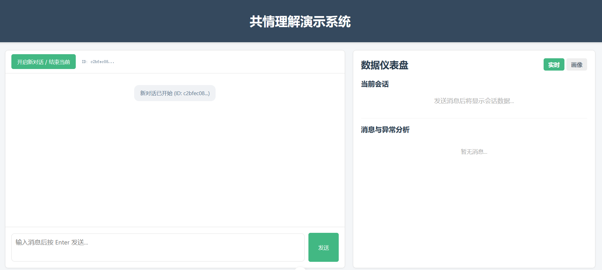
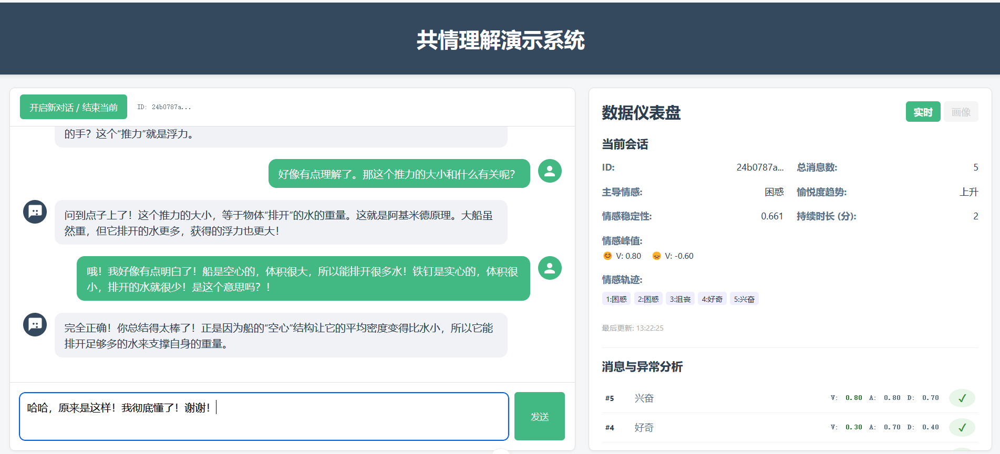
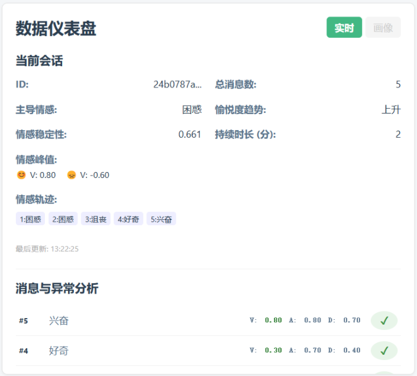
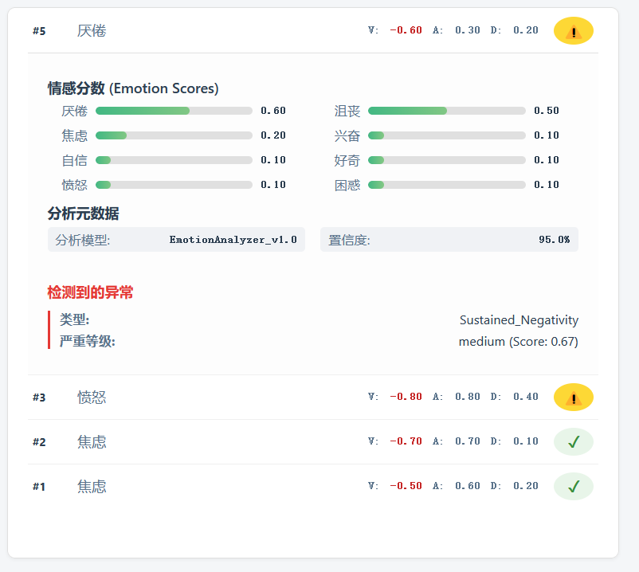
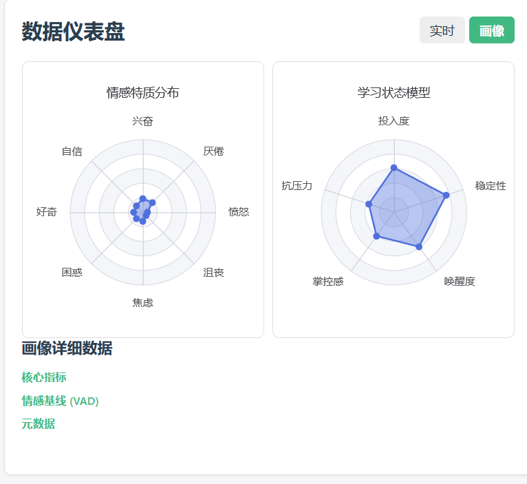
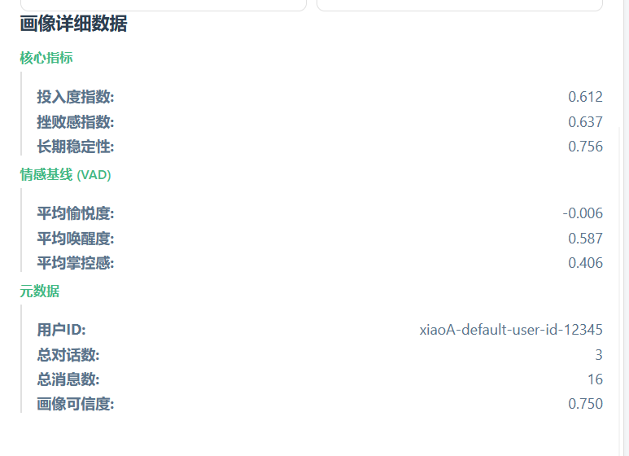

# 智慧导师-情感理解演示系统

[](https://opensource.org/licenses/MIT)

## 1. 项目简介

本项目是一个为智慧教育平台设计的“**共情理解**”模块的前后端演示系统。系统旨在模拟和展示如何捕捉、分析、存储和可视化学生在与 AI 导师对话过程中的情感动态。

其核心数据流遵循“**单句 -> 会话 -> 异常 -> 画像**”的四层递进模型，从即时的情感响应，到长期的、个性化的情感特质沉淀，为实现真正的个性化、自适应教学提供数据支持。

### 核心功能

*   **实时情感分析**: 模拟大语言模型，对用户的每一句话进行多维度情感分析。
*   **动态会话追踪**: 聚合单次对话中的情感数据，计算情感稳定性、趋势等宏观指标。
*   **异常状态检测**: 根据预设规则（如持续负面、情感突变），实时识别可能需要关注的风险信号。
*   **长期画像构建**: 在会话结束后，更新用户的长期情感画像，包括投入度指数、挫败感指数和多维情感雷达图等。
*   **数据可视化**: 提供一个清晰、可交互的数据仪表盘，实时展示上述所有数据的变化。

### 技术栈

*   **前端**: **Vue.js 3** (Composition API) + **Vite** + **Axios** + **ECharts**
*   **后端**: **Python 3.10** + **FastAPI** + **SQLAlchemy** (ORM) + **Alembic** (数据库迁移)
*   **数据库**: **SQLite**
*   **环境管理**: **Conda** (后端)

---

## 2. 项目结构

本项目采用标准的前后端分离架构。

```
.
├── backend/            # 后端 FastAPI 应用
│   ├── alembic/        # Alembic 数据库迁移脚本
│   ├── app/            # 核心应用代码 (分层架构)
│   ├── scripts/        # 辅助脚本 (数据清理、重置)
│   ├── .env            # 环境变量 (本地配置)
│   └── requirements.txt# Python 依赖
├── frontend/           # 前端 Vue.js 应用
│   ├── src/            # 核心应用代码
│   └── package.json    # Node.js 依赖
└── README.md           # 项目说明文档
```

---


## 3. 环境准备

在开始之前，请确保您的开发环境中已安装以下软件：

1.  **Git**: 用于版本控制。
2.  **Conda**: 用于管理后端的 Python 环境。 (推荐安装 [Miniconda](https://docs.conda.io/projects/miniconda/en/latest/))
3.  **Node.js**: 用于运行前端项目。(推荐 `v18.0` 或更高版本的 LTS 版)

---

## 4. 操作指南：如何运行本项目

请按照以下步骤，在您的本地机器上启动并运行此项目。

### 第一步：克隆项目

```bash
git clone https://github.com/Star-T-ing/Emotion-Analyze-Demo.git
cd Emotion-Analyze-Demo
```

### 第二步：配置并启动后端服务

1.  **进入后端目录**
    ```bash
    cd backend
    ```

2.  **创建并激活 Conda 环境**
    ```bash
    # 创建一个名为 emotion_analyze 的新环境
    conda create -n emotion_analyze python=3.10
    
    # 激活环境
    conda activate emotion_analyze
    ```

3.  **安装 Python 依赖**
    ```bash
    pip install -r requirements.txt
    ```

4.  **创建环境变量文件**
    ```bash
    # 在 backend 目录下，创建一个 .env 文件，并写入数据库连接地址
    echo "DATABASE_URL=sqlite:///./sql_app.db" > .env
    ```

5.  **初始化数据库**
    ```bash
    # 5.1 应用 Alembic 迁移，创建所有数据库表
    alembic upgrade head
    
    # 5.2 填充初始数据 (创建默认用户 "小A")
    python scripts/init_data.py
    ```

6.  **启动后端开发服务器**
    ```bash
    uvicorn app.main:app --reload
    ```
    服务器启动后，您应该会看到类似 `Uvicorn running on http://127.0.0.1:8000` 的输出。您可以访问 `http://127.0.0.1:8000/docs` 查看自动生成的 API 文档。

### 第三步：配置并启动前端服务

1.  **打开一个新的终端窗口**，确保后端服务保持运行。

2.  **进入前端目录**
    ```bash
    # 确保您位于项目根目录
    cd frontend
    ```

3.  **安装 Node.js 依赖**
    ```bash
    npm install
    ```

4.  **启动前端开发服务器**
    ```bash
    npm run dev
    ```
    服务器启动后，您应该会看到类似 `Local: http://localhost:5173/` 的输出。

### 第四步：开始使用

在您的浏览器中打开 **`http://localhost:5173`**，即可开始与演示系统进行交互。

---

## 5. 开发与维护指南

### 数据库管理

所有数据库结构的变更都应通过 Alembic 进行管理。

*   **修改模型后生成迁移脚本**:
    ```bash
    # 在 backend 目录下
    alembic revision --autogenerate -m "描述您的修改内容"
    ```
    **应用迁移到数据库**:
    ```bash
    alembic upgrade head
    ```

### 常用脚本

`backend/scripts/` 目录下提供了一些方便开发的辅助脚本。

*   **清空所有数据 (保留表结构)**:
    ```bash
    # 在 backend 目录下
    python scripts/clear_data.py
    ```
*   **硬重置数据库 (清空数据、删除所有表、并删除迁移历史)**:
    此脚本用于当模型发生重大变化，需要从一个全新的起点开始时。
    ```bash
    # 在 backend 目录下
    ./scripts/reset_database.sh
    ```
    *(首次执行前，可能需要赋予其执行权限: `chmod +x scripts/reset_database.sh`)*

---

## 6. 网页使用说明

本演示系统的前端界面旨在直观地展示从实时情感分析到长期用户画像构建的完整流程。界面主要分为**左侧的对话交互区**和**右侧的数据仪表盘**。




### 6.1 对话交互区 (左侧)

这是与 AI 导师进行模拟对话的核心区域。

*   **开启/结束会话**:
    *   点击 **`开启新对话 / 结束当前`** 按钮来启动一次全新的对话。
    *   **重要**: 此按钮同时会触发**结束上一次会话**的分析流程。后端会聚合上一次对话的所有数据，并更新右侧“用户画像”面板中的内容。
*   **对话窗口**:
    *   显示您与 AI 导师的完整对话历史。AI 的回复会以模拟打字机的“流式输出”效果呈现，以模拟大模型的思考过程。
*   **输入框**:
    *   在此处输入您想对 AI 说的话，按 `Enter` 键或点击“发送”按钮即可。




#### **如何使用预设数据？**

为了方便演示和测试，目前情感分析模拟器（`emotion_analyzer.py`）内置了三个主题的预设问答数据。您可以尝试在输入框中提问预设问题，以触发对话流程和情感分析。


当您的问题与预设内容匹配时，AI 将给出固定的回复，后端也会返回预设的、精心设计的情感分析数据，方便您观察特定情感场景下（如“持续负面”、“U型反转”等）数据面板的变化。

### 6.2 数据仪表盘 (右侧)

这是展示我们共情理解系统核心分析结果的区域，分为“实时”和“画像”两个视图。

*   **视图切换**:
    *   点击 **`实时`** 按钮，查看当前正在进行的对话的实时分析数据。
    *   点击 **`画像`** 按钮，查看基于所有已结束会话生成的用户长期情感画像。此按钮在完成第一次会话后才可点击。

#### **实时视图**

  

*   **当前会话**: 实时聚合和展示当前对话的宏观指标，如主导情感、情感稳定性、愉悦度趋势等。可折叠。
*   **消息与异常分析**:
    *   以列表形式展示当前对话中每一条消息的分析结果。可折叠。
    *   **摘要行**: 直观展示了每条消息的序号、主导情感和 VAD (愉悦度/唤醒度/掌控感) 核心数值。
    *   **异常标签**: 如果某条消息触发了异常（如情感突变、持续负面），右侧会显示一个 `⚠️` 警告标签。
    *   **展开详情**: 点击任意一条消息，可以展开一个详细面板，查看完整的情感分数分布（带可视化条）、分析元数据以及详细的异常信息。


#### **画像视图**

  

*   **情感特质分布 (雷达图)**: 基于用户的长期情感倾向（兴奋、自信、焦虑等8个维度），绘制用户的核心情感特质模型。
*   **学习状态模型 (雷达图)**: 基于投入度、抗挫力、掌控感等5个复合维度，评估用户的元认知学习状态。
*   **画像详细数据**: 以折叠面板的形式，条理清晰地展示用户画像的所有原始数值指标，如情感基线、总对话数、画像可信度等。

---

## 7. 数据库详细定义

### 整体设计方案

本数据库旨在通过四层递进的数据表，构建一个从**即时响应**到**长期洞察**的完整学生情感分析系统。数据流遵循“**单句 -> 会话 -> 异常 -> 画像**”的核心路径，逐层进行信息的聚合与提炼，为智慧导师系统提供全面、多维度的情感理解支持。

#### **单句情感分析表 (`messages`)**

*   **定位**: **系统的原子数据层与事实基础**。此表是所有后续分析的唯一数据源，记录了模型对用户每一条原始消息最直接的分析结果。
*   **核心更新逻辑**:
    *   **创建**: 每当用户发送一条新消息，就在本表中**插入 (INSERT)** 一条全新的、唯一的记录。
    *   **性质**: 此表为只增日志型（Append-Only），确保了数据的原始性和可追溯性。

#### **多轮对话情感分析表 (`conversations`)**

*   **定位**: **会话级别的实时状态快照**。此表聚合了单次会话至今的所有情感信息，为智慧导师的即时交互策略提供上下文依据。
*   **核心更新逻辑**:
    *   **创建**: 当会话的**首条消息**被处理后，在本表中**插入 (INSERT)** 一条对应此会话的新记录。
    *   **更新**: 该会话的每一条后续消息被处理后，都将**更新 (UPDATE)** 本表中对应的记录，刷新各项会话级别的聚合指标。

#### **异常情感检测表 (`anomalys`)**

*   **定位**: **系统的风险预警与事件记录中心**。这是一个事件驱动的表，专门用于记录那些需要特别关注的即时情感事件。
*   **核心更新逻辑**:
    *   **创建**: 每处理完一条新消息，后端规则引擎会进行检测。**只有**在检测到符合预设规则的异常情况时，才会向本表**插入 (INSERT)** 一条新的异常事件记录。
    *   **性质**: 此表同样为只增的事件日志。

#### **用户情感画像表 (`profiles`)**

*   **定位**: **用户的长期、个性化情感档案**。这是数据聚合的最高层，沉淀了用户的长期情感特质与行为模式，是实现深度个性化教学的核心。
*   **核心更新逻辑**:
    *   **创建**: 当用户的**首次会话结束时**，在本表中**插入 (INSERT)** 一条该用户的初始画像记录。
    *   **更新**: 对于后续的每一次会话，都在**会话结束**时**更新 (UPDATE)** 该用户的画像记录。其更新逻辑是一个**聚合过程**，它会综合利用**刚结束会话的原始单句数据**、**异常记录**以及**旧的画像状态**，来迭代计算新的长期指标。


### 表一：单句情感分析表(`messages`)

**定位**: 系统中最基础、最核心的原子数据层，记录模型对每条消息的直接分析结果。

| 字段名 (Field Name) | 类型 (Type) | 约束 (Constraints)                      | 字段说明与逻辑梳理                                           |
| :------------------ | :---------- | :-------------------------------------- | :----------------------------------------------------------- |
| `message_id`        | `Integer`   | `PRIMARY KEY`                           | **含义**: 单条消息的唯一标识符。<br>**来源/更新**: 创建时由数据库自动生成。 |
| `conversation_id`   | `String`    | `NOT NULL, FOREIGN KEY (conversations)` | **含义**: 该消息所属会话的唯一标识符。<br>**来源/更新**: 由客户端在会话开始时生成并随请求传递。 |
| `user_id`           | `String`    | `NOT NULL, FOREIGN KEY (users)`         | **含义**: 发送该消息的用户的唯一标识符。<br>**来源/更新**: 用户身份标识，随请求传递。 |
| `sequence`          | `INT`       | `NOT NULL`                              | **含义**: 消息在当前会话中的序号（从1开始）。<br>**来源/更新**: 后端根据`conversation_id`计算得出，创建时生成。 |
| `emotion_scores`    | `JSON`      | `NOT NULL`                              | **含义**: 记录与学习活动最相关的**复合学术情绪**及其强度。<br>**数据来源**: **模型直接输出**。<br>**理论依据**: 基于Pekrun的学术情绪分类，包含`兴奋`, `自信`, `焦虑`, `沮丧`, `愤怒`, `厌倦`, `困惑`, `好奇`8种核心情绪。<br>**示例**: `{"困惑": 0.8, "焦虑": 0.5, "好奇": 0.2...}` |
| `primary_emotion`   | `String`    | `NOT NULL`                              | **含义**: 从`emotion_scores`中提取出的、当前消息**最主导的核心情感**。<br>**来源/计算**: 在插入记录时，从`emotion_scores` JSON中找出得分（value）最高的那个情感（key）。<br>**更新时机**: 创建时生成。 |
| `valence`           | `FLOAT`     | `NOT NULL`                              | **含义**: VAD模型的情感愉悦度/正负性 (-1.0 到 1.0)。<br>**数据来源**: **模型直接输出**。 |
| `arousal`           | `FLOAT`     | `NOT NULL`                              | **含义**: VAD模型的情感唤醒度/激动程度 (0.0 到 1.0)。<br>**数据来源**: **模型直接输出**。 |
| `dominance`         | `FLOAT`     | `NOT NULL`                              | **含义**: VAD模型的情感支配度/掌控感 (0.0 到 1.0)。<br>**数据来源**: **模型直接输出**。 |
| `confidence_score`  | `FLOAT`     | `NOT NULL`                              | **含义**: 模型对本次整体分析的置信度。<br>**来源/更新**: 创建时生成。 |
| `analysis_model`    | `String`    | `NOT NULL`                              | **含义**: 分析所用的模型版本。<br>**来源/更新**: 创建时生成。 |
| `timestamp`         | `TIMESTAMP` | `NOT NULL`                              | **含义**: 该条分析完成的时间。<br>**来源/更新**: 创建时生成。 |


### 表二：多轮对话情感分析表  (`conversations`)

**定位**: 对单次会话的**整体状态**进行聚合与总结，反映会话的宏观图景。

| 字段名 (Field Name)   | 类型 (Type) | 约束 (Constraints)              | 字段说明与逻辑梳理                                           |
| :-------------------- | :---------- | :------------------------------ | :----------------------------------------------------------- |
| `conversation_id`     | `String`    | `PRIMARY KEY`                   | **含义**: 会话的唯一标识符。<br>**来源/更新**: 会话首条消息分析后创建。 |
| `user_id`             | `String`    | `NOT NULL, FOREIGN KEY (users)` | **含义**: 所属用户的唯一标识符。<br>**来源/更新**: 创建时写入。 |
| `start_time`          | `TIMESTAMP` | `NOT NULL`                      | **含义**: 本次会话**第一条消息**的时间戳。<br>**来源/计算**: 仅在创建该会话记录时写入一次，后续不再变更。 |
| `duration_minutes`    | `INT`       | `NOT NULL`                      | **含义**: 会话从开始到**最近一次活动**的持续时长（分钟）。<br>**来源/计算**: `(last_updated_at - start_time) / 60`。<br>**更新时机**: 每次会话有新消息时更新。 |
| `total_messages`      | `INT`       | `NOT NULL`                      | **含义**: 会话中的总消息数。<br>**来源/更新**: **增量更新**。每有新消息，执行 `total_messages = total_messages + 1`。 |
| `dominant_emotion`    | `String`    | `NOT NULL`                      | **含义**: **本次完整会话中，出现最频繁的`primary_emotion`**，反映对话的整体情感基调。<br>**来源/计算**: 通过查询`messages`表计算。<br>**更新时机**: 每次会话有新消息时更新。 |
| `sentiment_stability` | `FLOAT`     | `NOT NULL`                      | **含义**: **会话情感状态的稳定性**，综合考量VAD三维空间的变化。分值越低，波动越大。<br>**来源/计算**: 计算会话中连续两条消息VAD向量的欧几里得距离的平均值，再通过 `1 / (1 + avg_distance)` 归一化。<br>**更新时机**: 每次会话有新消息时更新。 |
| `valence_trend`       | `String`    | `NOT NULL`                      | **含义**: **情感愉悦度(Valence)的总体走向**。<br>**来源/计算**: 对会话中所有消息的`valence`值按`sequence`进行线性回归，根据斜率判断。枚举值: `'上升'`, `'下降'`, `'平稳'`。<br>**更新时机**: 每次会话有新消息时更新。 |
| `emotion_trajectory`  | `JSON`      | `NOT NULL`                      | **含义**: 按顺序记录每轮对话的**主导情感及其强度**，形成情感变化轨迹。<br>**来源/计算**: **追加更新**。每有新消息，向JSON数组末尾追加一个对象 `{"seq": 1, "emotion": "困惑", "score": 0.8}`。<br>**更新时机**: 每次会话有新消息时更新。 |
| `peak_sentiment`      | `JSON`      | `NOT NULL`                      | **含义**: 记录会话中出现的情感**正向与负向峰值**时刻，主要依据`valence`值。<br>**来源/计算**: 维护当前会话中`valence`最高和最低的记录。<br>**示例**: `{"positive": {"message_id": "xxx", "valence": 0.9}, "negative": {"message_id": "yyy", "valence": -0.8}}`<br>**更新时机**: 每次会话有新消息时更新。 |
| `last_updated_at`     | `TIMESTAMP` | `NOT NULL`                      | **含义**: 本次会话综合分析的最后更新时间。<br>**来源/更新**: 每次更新本表记录时更新。 |


### 表三：异常情感检测表 (anomalies)

**定位**: **风险预警系统**，识别需要关注或干预的即时情感状态。

| 字段名 (Field Name) | 类型 (Type) | 约束 (Constraints)                      | 字段说明与逻辑梳理                                           |
| :------------------ | :---------- | :-------------------------------------- | :----------------------------------------------------------- |
| `detection_id`      | `Integer`   | `PRIMARY KEY`                           | **含义**: 异常检测记录的唯一标识符。<br>**来源/更新**: 创建时由数据库自动生成。 |
| `conversation_id`   | `String`    | `NOT NULL, FOREIGN KEY (conversations)` | **含义**: 发生异常的会话ID。<br>**来源/更新**: 创建时写入。  |
| `user_id`           | `String`    | `NOT NULL, FOREIGN KEY (users)`         | **含义**: 发生异常的用户ID。<br>**来源/更新**: 创建时写入。  |
| `message_id`        | `Integer`   | `NOT NULL, FOREIGN KEY (messages)`      | **含义**: 直接触发本次异常检测的消息ID。<br>**来源/更新**: 创建时写入。 |
| `anomaly_type`      | `ENUM`      | `NOT NULL`                              | **含义**: 异常情况的通用分类。<br>**枚举类型与判断逻辑**: <br>    *   **`Sentiment_Shift (情感突变)`**: 连续两条消息的VAD向量欧氏距离 `sqrt((v2-v1)² + (a2-a1)² + (d2-d1)²) ` 超过一个高阈值（如0.7）。表示情绪状态发生剧烈、突然的转变。<br>    *   **`Sustained_Negativity (持续负面)`**: 连续N条消息（如3条）的`valence`均低于一个负阈值（如-0.5）。表示学生可能陷入了无法解决的困境或负面情绪循环。<br>    *   **`High_Intensity_Distress (高强度痛苦)`**: 单条消息的`valence`极低（如 < -0.7）**且**`arousal`较高（如 > 0.6）。通常代表强烈的焦虑、愤怒或恐慌，是需要高度关注的信号。<br>    *   **`State_Deviation (状态偏离)`**: 当前消息的VAD向量，与该用户画像中的`sentiment_baseline`的欧氏距离，超过了一个阈值。这是一种**个性化**的异常检测，表明用户显著偏离了其日常情感状态。 |
| `anomaly_score`     | `FLOAT`     | `NOT NULL`                              | **含义**: 异常程度的量化得分 (0-1)。<br>**来源/计算**: 根据`anomaly_type`的具体量化指标计算。<br>**更新时机**: 创建时生成。 |
| `severity_level`    | `ENUM`      | `NOT NULL`                              | **含义**: 将`anomaly_score`映射为人类可读的严重等级。<br>**枚举类型**: `'低'`, `'中'`, `'高'`, `'紧急'`。<br>**来源/更新**: 创建时生成。 |
| `status`            | `ENUM`      | `NOT NULL`                              | **含义**: 该条异常记录的处理状态。<br>**枚举类型**: `'未处理'`, `'已记录'`, `'已通知'`。<br>**来源/更新**: 创建时默认为`'未处理'`，可由其他系统更新。 |
| `timestamp`         | `TIMESTAMP` | `NOT NULL`                              | **含义**: 异常被检测到的时间。<br>**来源/更新**: 创建时生成。 |


### 表四：用户情感画像表 （`emotion_profiles`）

**定位**: 用户的**长期、个性化情感档案**，是实现自适应教学和深度个性化理解的基石。

| 字段名 (Field Name)     | 类型 (Type) | 约束 (Constraints) | 字段说明与逻辑梳理                                           |
| :---------------------- | :---------- | :----------------- | :----------------------------------------------------------- |
| `user_id`               | `String`    | `PRIMARY KEY`      | **含义**: 用户的唯一标识符。<br>**来源/更新**: 创建时写入。  |
| `last_updated_at`       | `TIMESTAMP` | `NOT NULL`         | **含义**: 画像最后一次更新的时间。<br>**来源/更新**: 每次会话结束时更新。 |
| `total_conversations`   | `INT`       | `NOT NULL`         | **含义**: 用于构建画像的总会话数。<br>**来源/更新**: 会话结束时，增量更新 `+1`。 |
| `total_messages`        | `BIGINT`    | `NOT NULL`         | **含义**: 历史会话中的总消息数。<br>**来源/更新**: 会话结束时，取出该会话的总消息数，增量更新。 |
| `emotion_distribution`  | `JSON`      | `NOT NULL`         | **含义**: 用户各类**情绪的长期分布**。<br>**来源/计算**: **移动平均法**。对用户所有历史消息的主导情绪分类计数。<br>**示例**: `{"兴奋": 7, "沮丧": 5, ...}` |
| `sentiment_baseline`    | `JSON`      | `NOT NULL`         | **含义**: 用户在VAD三维空间中的**长期情感“重心”**。<br>**来源/计算**: **移动平均法**。计算用户所有历史消息的`valence`, `arousal`, `dominance`的平均值。<br>**示例**: `{"avg_valence": 0.2, "avg_arousal": 0.4, "avg_dominance": 0.5}` |
| `stability_baseline`    | `FLOAT`     | `NOT NULL`         | **含义**: 用户**长期情感稳定性**。<br>**来源/计算**: **移动平均法**。计算用户所有历史会话的sentiment_stability的平均值。<br>**更新时机**: 每次会话结束时更新。 |
| `emotional_transitions` | `JSON`      | `NOT NULL`         | **含义**: **用户典型的情感转换模式**，揭示其反应倾向。<br>**来源/计算**: 会话结束时，分析会话中的情感转移频率，更新全局的转移概率矩阵。<br>**示例**: `{"困惑": {"专注": 0.6, "沮丧": 0.3, ...}, ...}` |
| `engagement_index`      | `FLOAT`     | `NOT NULL`         | **含义**: **长期学习投入度指数**，评估学生的积极性。<br>**来源/计算**: 基于多种指标综合计算。<br>**更新时机**: 每次会话结束时更新。 |
| `frustration_index`     | `FLOAT`     | `NOT NULL`         | **含义**: **长期学习挫败感指数**，反映学生的负面体验程度。<br>**来源/计算**: 基于多种指标综合计算。<br>**更新时机**: 每次会话结束时更新。 |
| `anomaly_frequency`     | `FLOAT`     | `NOT NULL`         | **含义**: 异常情感的发生频率（`总异常数/总消息数`）。<br>**来源/更新**: 每次会话结束时更新。 |
| `common_anomaly_types`  | `JSON`      | `NOT NULL`         | **含义**: 该用户最常见的异常类型列表及其占比。<br>**来源/更新**: 每次会话结束时更新。 |
| `profile_confidence`    | `FLOAT`     | `NOT NULL`         | **含义**: 画像数据的可信度，由数据量代表。<br>**来源/计算**: 可由`1 - 1/(total_conversations + 1)`计算。<br>**更新时机**: 每次会话结束时更新。 |


### 其他：用户表 （`users`）

**定位：**该演示系统省略了用户注册登录部分，只预设一个默认用户。但为了维持数据库的**关系完整性**，我们仍然需要创建一个users表。

| 字段名       | 类型        | 约束          | 含义                |
| :----------- | :---------- | :------------ | :------------------ |
| `user_id`    | `String`    | `PRIMARY KEY` | 用户的唯一标识符    |
| `username`   | `String`    | `NOT NULL`    | 用户的名称，如“小A” |
| `created_at` | `TIMESTAMP` | `NOT NULL`    | 用户创建时间        |

---